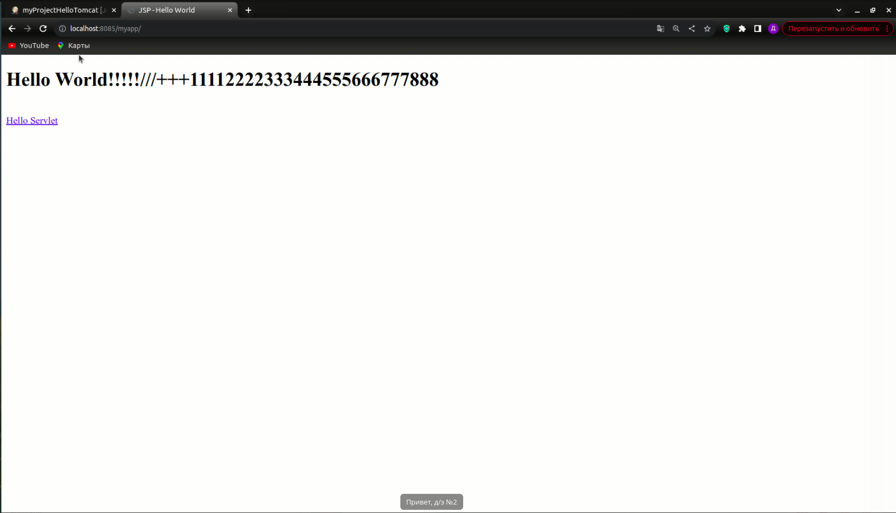
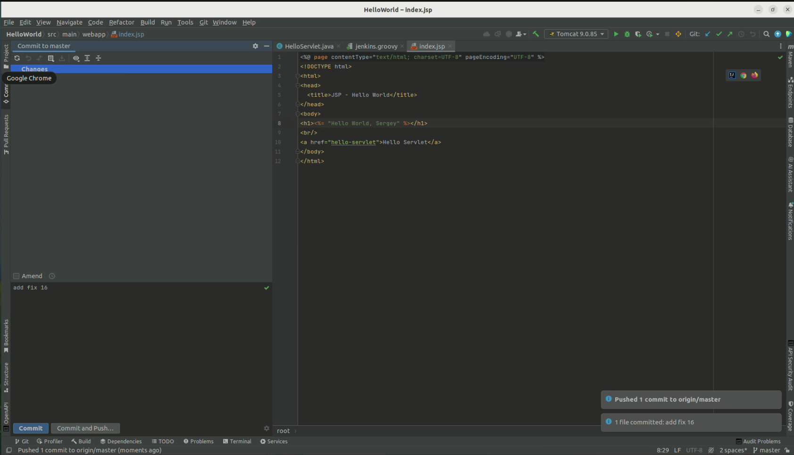
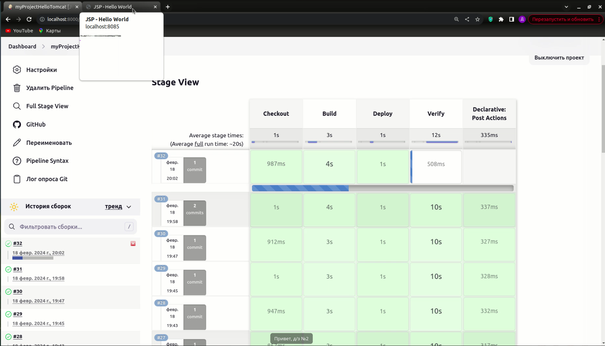
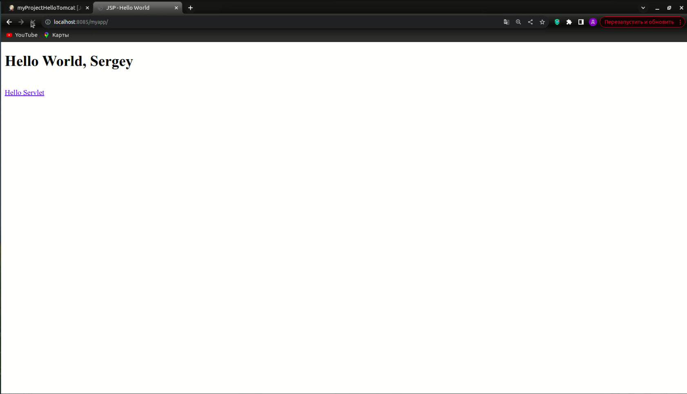

# HelloWorld

`HelloWorld` - это простое веб-приложение, созданное с использованием Java и развернутое на сервере Tomcat.
Этот проект также интегрирован с системой автоматической сборки Jenkins, которая автоматически разворачивает приложение
на сервере Tomcat после каждого коммита в мастер-ветку репозитория на GitHub.

## Задание

1. Установите линукс (можно на виртуальную машину)
2. Если это линукс с gui задание должно быть выполнено через командную строку
3. Установите JAVA
4. Установите Tomcat
5. Создайте Юзера tomcat и разрешите его доступ к папке где лежит томкат
6. Создайте любое простое WEB приложение на порту 8085
7. Установите Jenkins (можно локально, можно на виртуалку) (+2 баллов, если дженкинс лежит на отдельной виртуальной
   машине)
8. Создайте соединение между Jenkins и Гитом (ssh)
9. Пусть после каждого коммита в мастер ветку на Git хаб Jenkins инсталит приложение на сервер (Tomcat)

## Реализация

1. Запускаем WEB приложение на порту 8085

2. Меняем файл и отправляем изменения в Git

3. Jenkins идет в Git, берет от туда изменения, затем собирает и инсталит приложение на сервер Tomcat

4. Tomcat должен вывести изменения

